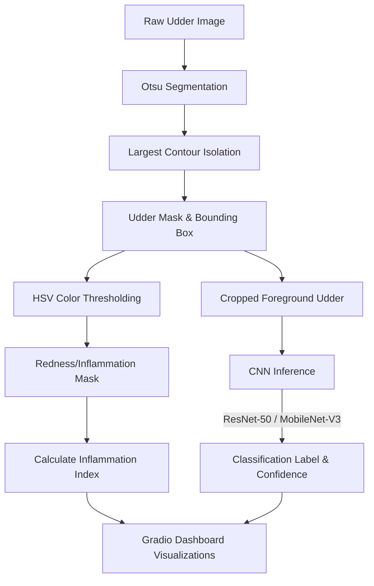

<div align="center">

# 🐄 Dairy Mate: Cattle Mastitis Detection Dashboard

**An interactive computer vision and deep learning application for automated cattle udder health monitoring**

[](https://www.python.org/)
[](https://pytorch.org/)
[](https://opencv.org/)
[](https://gradio.app/)
[](LICENSE)

*Real-time udder segmentation · Skin inflammation hotspot mapping · Fine-tuned **ResNet-50** & **MobileNet-V3** CNNs · Gradio web UI*

[🚀 Quick Start](#-quick-start) · [✨ Features](#-features) · [📁 Project Structure](#-project-structure) · [🔍 Dataset & Annotation](#-dataset--annotation) · [📄 License](#-license)

</div>

---

## 📖 Overview

This project implements an end-to-end machine learning and computer vision pipeline for **Cattle Mastitis Detection** using raw udder photographs. It includes:
1. **Automated Annotation:** A python script that indexes raw images, estimates udder bounding boxes, and calculates initial inflammation levels.
2. **Foreground Segmentation:** Isolating the udder from cluttered barn backgrounds using thresholding and morphological operations.
3. **Inflammation Mapping:** Detecting reddish skin irritation hotspots using HSV color space segmentation.
4. **Deep Learning Classification:** Fine-tuning pre-trained **ResNet-50** and **MobileNet-V3-Large** architectures to identify Mastitis infections.
5. **Interactive UI:** A dark-themed Gradio dashboard for model selection, localized diagnostic visualization, and real-time inference.

> ⚠️ **Disclaimer:** This tool is intended for research, educational, and farm management decision-support purposes. It is not a veterinary diagnostic device and does not replace professional veterinary consultation.

---

## 🔄 Pipeline Workflow



| Stage | Details |
|:------|:--------|
| **Input** | Raw udder photograph (JPG/PNG/JFIF) |
| **Segmentation** | Grayscale conversion, Gaussian blur, Otsu's thresholding, morphological closing/opening, largest contour extraction. |
| **Inflammation Detection** | Red color range thresholding in HSV color space restricted within the segmented udder boundary. |
| **Classification Models** | ResNet-50 (highest capacity) & MobileNet-V3-Large (efficiency for mobile/edge cameras). |
| **Output** | Prediction label (Healthy / Mastitis), confidence score, cropped udder region, red inflammation hotspot overlay, and Inflammation Index (%). |

---

## ✨ Features

* **Real-time Image Processing:** Instantly segments the cow's udder from the background and maps inflammation hotspots on the fly.
* **Inflammation Index (%):** Quantifies redness on the udder surface ($100 \times \frac{\text{inflamed pixels}}{\text{total udder pixels}}$). Statistically, Mastitis udders display a significantly higher index than healthy ones.
* **Multi-Model Support:** Easily toggle between ResNet-50 and MobileNet-V3 to contrast predictions.
* **Edge-Ready Design:** The MobileNet-V3 model is lightweight and highly optimized, suitable for edge devices (such as smart farm cameras).
* **Multi-GPU Training Configuration:** The Jupyter training notebook is configured to run on Kaggle's dual NVIDIA Tesla T4 GPUs with PyTorch's `DataParallel` wrapper.

---

## 📁 Project Structure

```
Dairy-Mate-Mastitis-Detection/
│
├── 🐍 segmentation.py        # Core image segmentation & CV utilities
├── 🐍 annotate.py            # Automatic dataset annotation & registry script
├── 📓 train.ipynb            # Training notebook configured for CPU/Kaggle T4 GPUs
├── 🐍 app.py                 # Gradio dashboard application (script version)
├── 📓 app.ipynb              # Gradio dashboard application (notebook version)
├── 📋 requirements.txt       # Python environment dependencies
├── 📄 LICENSE                # Apache License 2.0
│
├── 📁 Dataset/               # Cattle udder images (75 Mastitis, 25 Healthy)
│   ├── 📁 healthy_images/
│   ├── 📁 Mastitis_images/
│   └── 📄 annotations.json   # Generated by annotate.py
│
├── 📁 Model/                 # Fine-tuned model weights (safetensors format)
│   ├── 📄 resnet50_mastitis.safetensors
│   └── 📄 mobilenetv3_mastitis.safetensors
│
└── 📁 examples/              # Sample images for testing in the UI
```

---

## 🔍 Dataset & Annotation

The raw dataset contains two categories:
* **Healthy Images:** 25 files showing normal, uninfected cow udders.
* **Mastitis Images:** 75 files displaying swollen, inflamed, or red cow udders.

### Automatic Annotation
Before training, run `python annotate.py`. This script:
1. Validates all image resolutions.
2. Extracts class labels.
3. Automatically computes the udder bounding box using contour detection.
4. Estimates the initial red inflammation index.
5. Saves this metadata to `Dataset/annotations.json`.

---

## 🚀 Quick Start

### 1. Install Dependencies

Ensure you have Python 3.8+ installed, then run:
```bash
pip install -r requirements.txt
```

### 2. Annotate the Raw Images

Run the annotation script to localize udders and generate `Dataset/annotations.json`:
```bash
python annotate.py
```

### 3. Model Training (Optional)

Open `train.ipynb` in VS Code or Jupyter Notebook, or upload it to Kaggle to train the models on your hardware:
* To train on Kaggle, upload the `Dataset` directory (containing `healthy_images`, `Mastitis_images`, and the generated `annotations.json`).
* The notebook automatically detects if multiple GPUs are available and uses PyTorch `DataParallel`.
* Trained weights will be saved as `Model/resnet50_mastitis.safetensors` and `Model/mobilenetv3_mastitis.safetensors`.

### 4. Launch the Diagnostics Dashboard

Start the local dashboard:
```bash
python app.py
```
Or open `app.ipynb` in Jupyter Notebook and run all cells. Open your browser and navigate to **`http://127.0.0.1:7860`**.

---

## 🛠️ Tech Stack

* **Python**
* **PyTorch & TorchVision** (Deep Learning framework)
* **OpenCV** (Traditional computer vision & segmentation)
* **Gradio** (Interactive web UI framework)
* **Pillow** (Image manipulation)
* **Safetensors** (Safe and fast model serialization)
