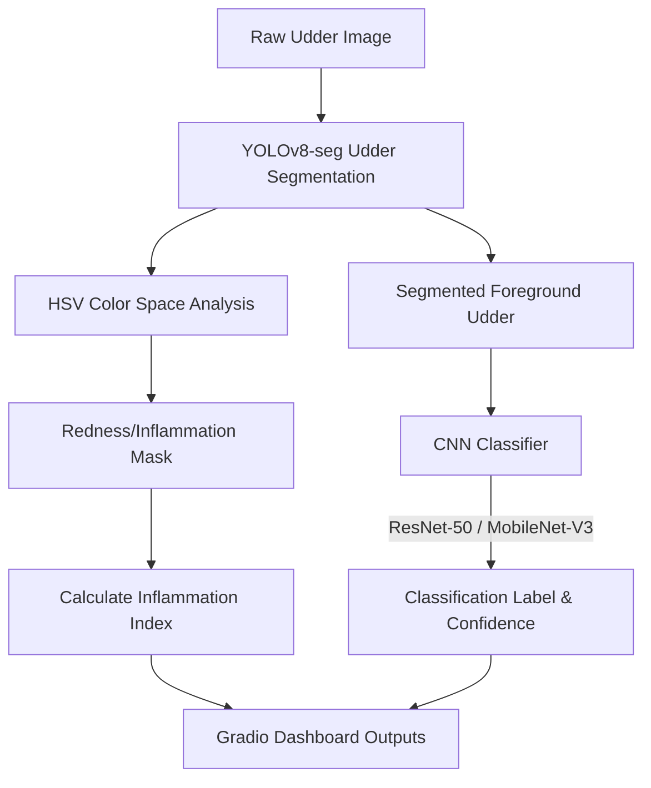

<div align="center">

# 🐄 Dairy Mate: Cattle Mastitis Detection Dashboard

**An interactive computer vision and deep learning application for automated cattle udder health monitoring**

[](https://www.python.org/)
[](https://pytorch.org/)
[](https://opencv.org/)
[](https://gradio.app/)

*Real-time udder segmentation (YOLOv8-seg) · Auto-labeling (Grounding DINO + SAM) · Fine-tuned **ResNet-50** & **MobileNet-V3** CNNs · Gradio web UI*

[🚀 Quick Start](#-quick-start) · [✨ Features](#-features) · [📁 Project Structure](#-project-structure) · [🔍 Dataset & Annotation](#-dataset--annotation)

</div>

---

## 📖 Overview

This project implements an end-to-end machine learning and computer vision pipeline for **Cattle Mastitis Detection** using raw udder photographs. It includes:
1. **Zero-Shot Auto-Labeling:** A pipeline using Grounding DINO and SAM to automatically outline udders in the raw dataset, generating YOLO polygon masks.
2. **Deep Learning Segmentation:** Training a custom, lightweight **YOLOv8-seg** model to locate and segment the udder in real-time, completely ignoring legs or ground clutter.
3. **Inflammation Mapping:** Detecting reddish skin irritation hotspots inside the segmented udder region using HSV color space mapping.
4. **Deep Learning Classification:** Fine-tuning pre-trained **ResNet-50** and **MobileNet-V3-Large** architectures to identify Mastitis infections.
5. **Interactive UI:** A slate-dark Gradio dashboard for model selection, localized diagnostic visualization, and real-time inference.

> ⚠️ **Disclaimer:** This tool is intended for research, educational, and farm management decision-support purposes. It is not a veterinary diagnostic device.

---

## 🔄 Pipeline Workflow



---

## ✨ Features

* **Real-time YOLOv8 Segmentation:** Uses a custom-trained, lightweight YOLOv8-seg model to isolate cow udders instantly.
* **Inflammation Index (%):** Quantifies redness on the udder surface ($100 \times \frac{\text{inflamed pixels}}{\text{total udder pixels}}$).
* **Multi-Model Support:** Easily toggle between ResNet-50 and MobileNet-V3 to compare predictions.
* **Edge-Ready Design:** Highly optimized scripts that run locally on a laptop GPU (RTX 3050) or edge camera systems.

---

## 📁 Project Structure

```
Dairy-Mate-Mastitis-Detection/
│
├── 📁 src/                   # Active Python source scripts
│   ├── 🐍 app.py             # Gradio web dashboard
│   ├── 🐍 segmentation.py    # YOLO segmentation & CV utilities
│   ├── 🐍 annotate.py        # Dataset index catalog creator
│   ├── 🐍 auto_annotate.py   # Grounding DINO + SAM auto-labeler
│   ├── 🐍 train.py           # CNN classifier training script
│   └── 🐍 train_yolo.py      # YOLOv8-seg training script
│
├── 📓 app.ipynb              # Notebook version of the Gradio app
├── 📓 train.ipynb            # Notebook version of classifier training
├── 📋 requirements.txt       # Python environment dependencies
├── 📄 dataset_yolo.yaml      # YOLO dataset configuration
├── 📄 .gitignore
│
├── 📁 Dataset/               # Cattle udder images (75 Mastitis, 25 Healthy)
│   ├── 📁 healthy_images/
│   ├── 📁 Mastitis_images/
│   └── 📄 annotations.json   # Generated by src/annotate.py
│
├── 📁 Model/                 # Fine-tuned model weights
│   ├── 📄 best_udder_yolo.pt # Custom YOLOv8-seg segmenter
│   ├── 📄 resnet50_mastitis.safetensors
│   └── 📄 mobilenetv3_mastitis.safetensors
│
└── 📁 examples/              # Sample images for testing in the UI
```

---

## 🚀 Quick Start

### 1. Install Dependencies
Ensure you have Python 3.8+ installed, then run:
```bash
pip install -r requirements.txt
```

### 2. Auto-Annotate and Train YOLOv8-seg (Optional)
If you want to re-generate the dataset and train the YOLO segmenter from scratch:
```bash
# 1. Generate YOLO segmentation masks automatically
python src/auto_annotate.py

# 2. Train custom YOLOv8-seg model
python src/train_yolo.py
```

### 3. Catalog Dataset and Train Classifiers (Optional)
To catalog your classification indices and train ResNet/MobileNet models:
```bash
# 1. Generate annotations.json catalog registry
python src/annotate.py

# 2. Run classifier training loop
python src/train.py
```

### 4. Launch the Web Application
Start the interactive Gradio dashboard:
```bash
python src/app.py
```
Or open the `app.ipynb` notebook and run all cells. Open your browser and navigate to **`http://127.0.0.1:7860`**.
